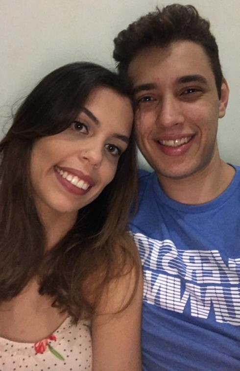
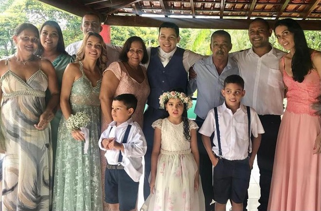

    

## Quem é Júlia Martins?

Bem vindo à miha página! Sou Júlia Martins, licencianda em Matemática pela UFV - campus Florestal, natural de Curvelo - MG e residente em Felixlândia - MG. Tenho 3 irmãos, 6 sobrinhos, sou Católica Apostólica Romana. Atualmente faço parte do PIBID que vem agregando e aperfeiçoando experiências e aprendizados que contrinuem significamente para o meu futuro como docente. Nessa página compartilho um pouco de alguns detalhes do PIBID, momentos(fotos) vivenciados antes da pandemia na UFV e minhas mídias sociais.

## Fotos

<figure class = "half">
    
    
</figure>

